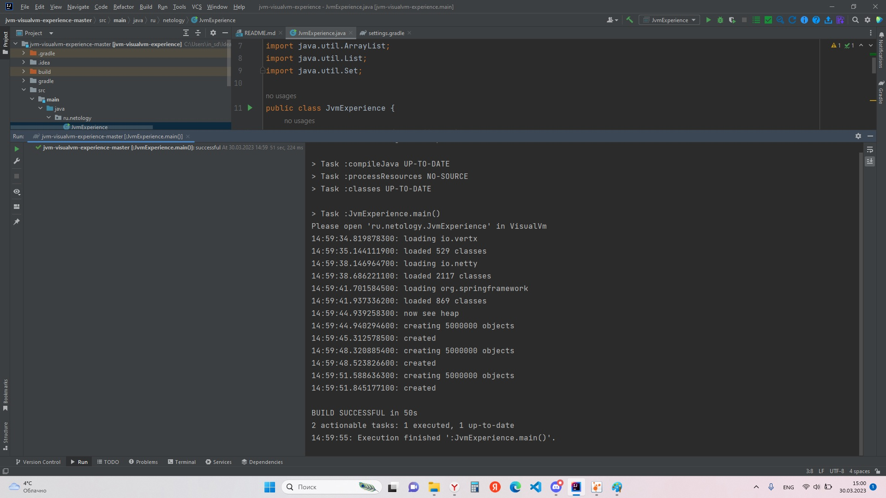
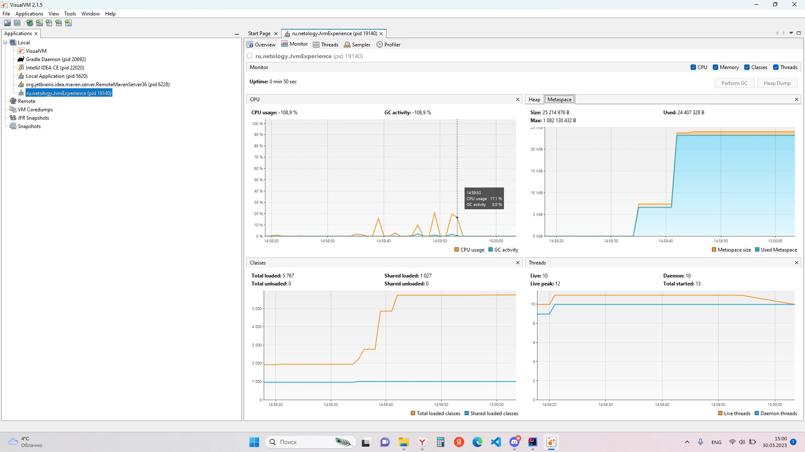
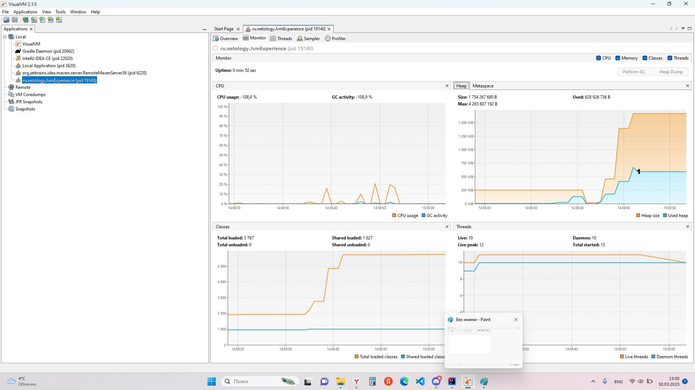

1. вкладка Metaspace: 
   до 14:59:41 загружались  в metaspace необходимые классы для работы приложения
2.  вкладка Heap: 
   14:59:44 в кучу загрузилось 5 000 000 объектов, сработал сборщик мусора и произошла оптимизация памяти
   14:59:48 в кучу загрузилось еще 5 000 000 объектов
   14:59:51 в кучу загрузилось еще 5 000 000 объектов 
   в точке 1(на рисунке) сработал сборщик мусора и программа продолжила работать дальше.
   14:59:55 метод main() закончилл свою работу
   the end

    
    
    
